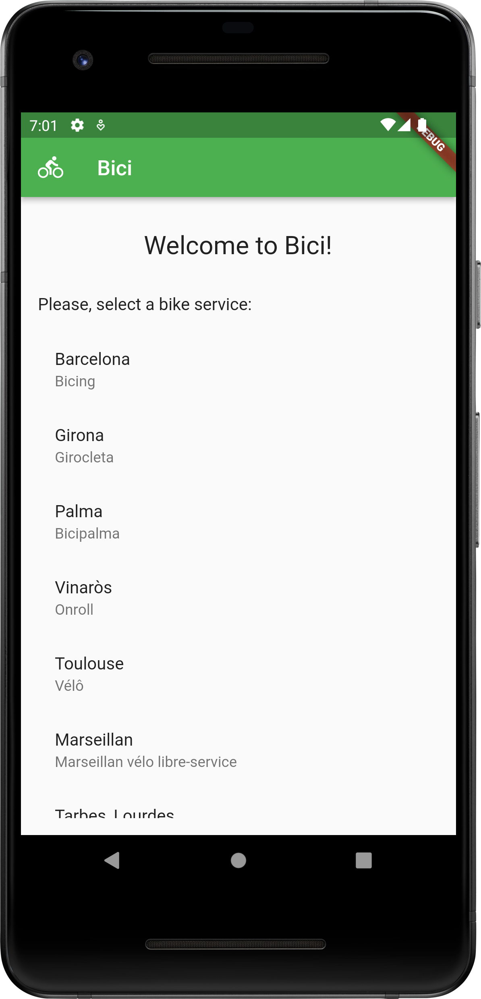
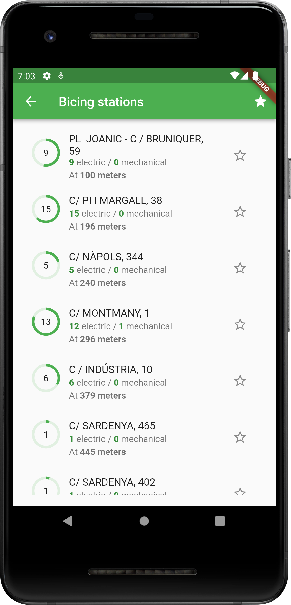
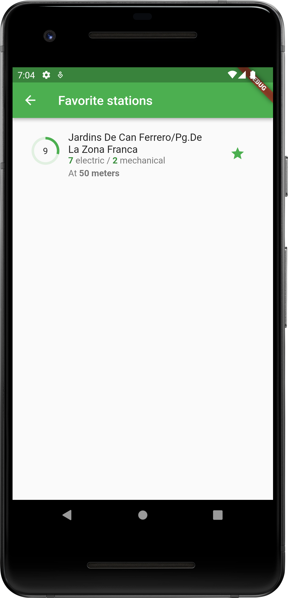
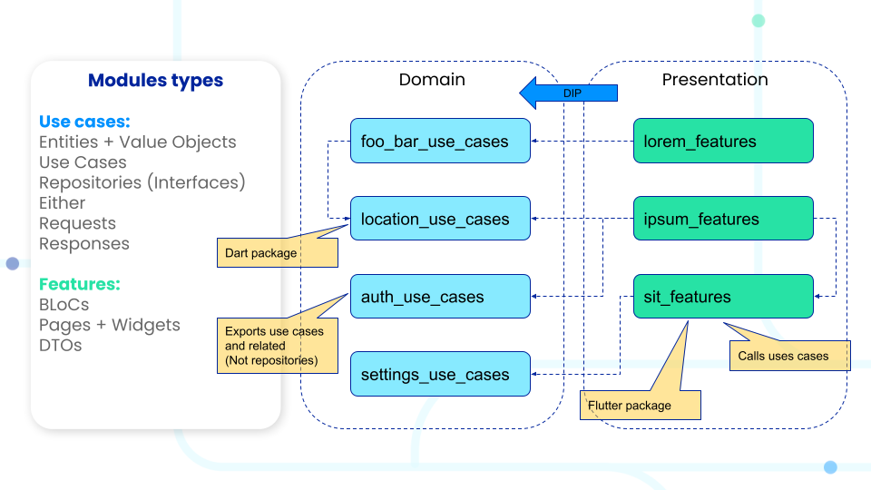
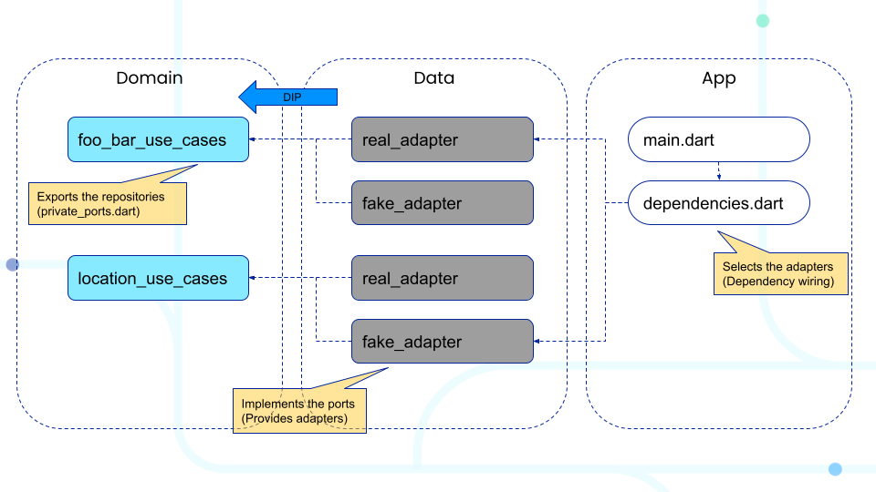

# Bici sample app

With this app you can find available bikes and e-bikes near to you. The app allows you
to locate bikes in a database that containes real time info of the public bicycle
services from more than 400 cities.

This project has been created as a demonstration of the modular architecture used
in Flutter projects at [Stuart](https://stuart.com/blog/tech/).

This app relies on the public [API](http://api.citybik.es/v2/) provided by
[CityBikes](https://citybik.es/).

|  |  |  |
|-------------------------------------------------|-------------------------------------------------|-------------------------------------------------|

Where are the maps? For sake of simplicity, this project doesn't contain maps. This is to avoid
the developers having to set a Google Maps API key in the project.

# How to run it

1. Install all dependencies:
   ```shell
   make pub_get_all
   ```
2. With a device connected run the app:
   ```shell
   flutter run
   ```
Please check [Makefile](Makefile) to discover all the available `make` commands.

# Architecture overview

This architecture will be mainly composed by **Use Cases** and **Features** packages that will
work as independent modules.



This architecture has deeply inspired the talk
[Android at Scale @Square](https://www.droidcon.com/2019/11/15/android-at-scale-square/).

## What is a Use Case?

A Use Case orchestrates the flow of data to and from the Entities by implementing application
specific business rules. A Use Case belongs to the Domain layer and it is used by classes from
Presentation layer.

For instance if in the Presentation layer there are some classes grouped in a Feature Package
implementing all the UI necessary for a user to log in, these classes for example will depend on
some Authentication Use Cases Package that could expose a LogInUseCase that will login the user
after receive a username and a password as parameters.

## What is a Use Cases package?

A Use Cases Package is the one that exposes Use Cases that can be used by Features Packages or
other Use Cases Packages. These Use Cases grouped in the same package are related to each other.
Some examples:

**Authentication Use Cases Package:** Log in user, register new user, remember password, etc.

**Articles Use Cases Package:** Get all articles, create new article, archive article, etc.

A Use Cases Package only exposes Use Cases as public interfaces and also the related Domain Models.
The same package contains the implementations for all the declared Use Cases. This means that it
contains all the logic that belongs to the domain layer.

In the other hand, the package does not implement any logic that belongs to the data layer. This
means that any Repository or other low level classes used by the Use Cases, needs to be
implemented somewhere else.

The place to implement all the data logic of the Use Cases is in the inner Adapter packages. These
inner packages will implement interfaces exported in a file name `private_ports.dart`. This file
will export interfaces like Repositories which the Use Cases will depend on. Each Use Cases Package
will have at least one of the following inner packages:

- **Real adapters:** Contains the real implementations for the interfaces defined in the
  private_ports.dart file. These are the implementations that are used at production.
- **Fake adapters:** Contains fake implementations for the interfaces defined in the
  private_ports.dart file. This package can be used to wire up the dependencies for UI automated
  testing or to create development apps (Apps to develop and test certain features in a isolated
  context).

:information_source: Notice here the use of words Ports and Adapters where they have the same
meaning as in the Port and Adapters architecture (Or Hexagonal architecture).



## What is a Features Package?

Features Packages have the UI and presentation code to implement a specific functionality of the
app. Normally are composed of BLoCs, Screens (Or pages), Widgets and data classes that will be
used in the communication between BLoCs and Screens/Widgets. This means that a Features Package
will contain only logic from the Presentation Layer and they will depend on Use Cases packages
to get the implementation of the business logic needed for that feature.

Here are some examples of possible Features Packages:

- login: Groups all the screens related to login/register.
- home: Groups all the code for the main screen.
- articles: Groups all the code that let the user read articles.
- publish_article: Groups all the code that let the user publish articles.
- navigation_drawer: The side drawer with the menu to navigate.

## Dependency management

This project uses construction-based dependency injection. This means that all the classes will
receive their dependencies as parameters of their constructor.

```dart
class GetUserByIdUseCase {
  final UserRepository userRepository;

  GetUserByIdUseCase(this.userRepository); // Dependencies injected by constructor

  @override
  Stream<User> call(String userId) {
    return userRepository.getUserById(userId);
  }
}
```

To satisfy these dependencies each package with concrete implementations will expose a file called
`dependency_configurator.dart` with an implementation of an interface called
[DependencyConfigurator](packages/shared/all/core/lib/src/dependencies/dependency_configurator.dart).
This interface defines a method that must be implemented and it receives a `GetIt` instance that can
be used to register all the dependencies that are provided by the package.
[GetIt](https://pub.dev/packages/get_it) is simple but powerful service locator, but if you want
you can use any other tool with this architecture. `DependencyConfigurator` also receives a
`DependencyConfiguratorContext` instance with extra configuration info.

```dart
// dependency_configuration_context.dart
class DependencyConfigurationContext {
  final String apiBaseUrl;

  ConfigurationContext({
    required this.apiBaseUrl,
  });
}

// dependency_configurator.dart
abstract class DependencyConfigurator {
  void configureDependencies(
    DependencyConfiguratorContext context,
    GetIt getIt,
  );
}
```

Then these `dependency_configurator.dart` can be used from a main module to register all the
different dependencies. For instance from main method we can call the following
`configureDependencies()` method:

```dart
// dependencies.dart
final configurators = [
  ArticlesDependencyConfigurator(),
  ArticlesFakeAdaptersDependencyConfigurator(),
];

void configureDependencies(DependencyConfigurationContext context) {
  for (var configurator in configurators) {
    configurator.configureDependencies(context, GetIt.instance);
  }
}
```

When a configured dependency needs to be injected, it can be done by using the method `inject()`.
These method will be used normally from code located in the Presentation layer in this way:

```dart
class ListUsersScreen extends StatelessWidget {
  @override
  Widget build(BuildContext context) {
    return BlocProvider(
      create: (context) => ListUsersBloc(
        inject<GetAllUsersInteractor>(), // Use of the inject() method
        inject<GetUserByIdInteractor>(),
      ),
      child: Container(),
    );
  }
}
```
